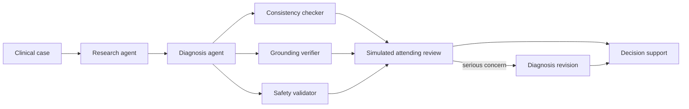

<div align="center">

# GovBench-Clinical

**A measurement-audited benchmark and clinician-facing workbench for governed multi-agent clinical AI**


</div>

GovBench-Clinical runs clinical cases through a multi-agent language-model pipeline and measures what each
governance layer — a grounding verifier, a safety validator, a consistency checker and a simulated attending review —
actually changes. It pairs the benchmark with a web application that presents AI output to clinicians the way it
should be presented: what was checked, what was **not** checked, and what still needs a human decision.

> [!IMPORTANT]
> This is research software for decision support. Its output is generated by AI, has not been reviewed by a clinician,
> and must not be used to diagnose or treat patients.

---

## Contents

- [Highlights](#highlights)
- [How it works](#how-it-works)
- [Results](#results)
- [The application](#the-application)
- [Getting started](#getting-started)
- [Benchmarking and analysis](#benchmarking-and-analysis)
- [API](#api)
- [Project structure](#project-structure)
- [Limitations and roadmap](#limitations-and-roadmap)
- [Citation](#citation)
- [Authors](#authors)

---

## Highlights

- **Five governance levels** (G0–G4), from an ungoverned baseline to all checks combined, on identical inputs.
- **Closed-loop governance** — serious concerns send the diagnosis back for one revision, instead of only annotating it.
- **Measured, not assumed** — a re-analysis module rescored every stored run from its raw model output, audited the
  database for values that were not measured, and reports paired statistics with confidence intervals.
- **Clinician-facing output** — alerts grouped by severity, an explicit list of checks that did not run, a physician view
  and a clinical-assistant view with an SBAR handoff.
- **Blinded clinician review** — a built-in rating tool that produces the human validation data the benchmark needs.
- **Deterministic safety rules** — 14 contraindication rules (e.g. NSAIDs in renal impairment, metformin at low eGFR,
  sildenafil with nitrates) run on every case, independent of the model, each with its guideline source.
- **Re-checked revisions** — after a closed-loop revision the enabled checks run again on the revised diagnosis.
- **Safe by default** — identifiable patient data is blocked before it reaches a model provider, case text is fenced
  against prompt injection, run endpoints can require an API token, and stored case text expires after a retention period.
- **Honest failure handling** — a failed live model call returns an error; it never falls back to simulated output. The
  offline demo generator is labelled "not AI" on every result and cannot be used for experiments.
- **Multiple providers** — Groq, NVIDIA NIM, Google Gemini and OpenRouter, with pooled-key rotation and rate-limit backoff.

---

## How it works



The research agent structures the case; the diagnosis agent proposes a ranked differential. The checks read only the
case and the diagnosis, so they run in parallel. With closed loop enabled, a hallucinated claim, a HIGH or CRITICAL
safety flag, a severe inconsistency or a revision request triggers one bounded revision of the diagnosis.

| Level | Benchmark variant | Checks that run |
|:---:|:---:|---|
| G0 | V1 | None |
| G1 | V2 | Grounding verifier |
| G2 | V3 | Simulated attending review (a language model, not a human) |
| G3 | V4 | Safety validator |
| G4 | V5 | All of the above, plus the consistency checker |

---

## Results

Measured on 750 stored runs: 150 cases × 5 variants, Llama-3.2-11B served by NVIDIA NIM, open-loop governance.
Regenerate with `uv run govbench-rigor`; the full report is available in the application's **Research Findings** page.

| Question | Measured answer |
|---|---|
| Does governance change the diagnosis? | Rarely: the primary diagnosis differs from the baseline in at most 2.7% of cases, with no significant accuracy difference (paired Wilcoxon, p ≥ 0.18). |
| Why do governed variants score lower on quality? | 94–96% of the drop comes from the rubric penalising each variant's own detectors; the ungoverned baseline has none to be penalised by. |
| Do the alerts identify wrong diagnoses? | Not yet: the safety validator raises at least one alert on every run, and each governance signal detects misdiagnosis at AUROC 0.40–0.56 (0.5 is chance). |
| How accurate is the pipeline? | 0.29 overall and 0.38 on the 71 cases with a real diagnosis label, after correcting a substring-matching scorer that reported 0.74. |
| Is the study powered? | No: variants disagree with the baseline on 1–2 of 71 cases (exact McNemar p ≥ 0.5, 1.0 after Holm correction). A 5-point difference needs 312–940 paired cases, which is why a 300-question MedQA benchmark with its answer key is included. |
| Is the model's stated confidence reliable? | No: expected calibration error is 0.29. The interface presents likelihoods as a ranking, not a probability. |
| What does governance cost? | Median end-to-end latency rises from 45 s (G0) to 111 s (G4) on the benchmark model; tokens rise from about 3,100 to 8,400 per case. |

> [!NOTE]
> Several columns in `results/benchmark_results.db` (`uncertainty_jru`, `llm_judge_score`, `risk_adjusted_quality`,
> `governance_efficiency_factor`, `hitl_minutes`) were populated by a post-hoc script rather than measured. The analysis
> detects and excludes them. The original run database is kept as `results/benchmark_results.db.bak`.

These are negative and methodological findings: under open-loop governance and lenient automatic scoring, apparent
safety and quality effects come largely from the evaluation itself. The closed-loop experiment and clinician validation
described in the roadmap test whether governance can do better.

---

## The application

| Page | Purpose |
|---|---|
| **Clinician Workspace** | Enter a patient and choose a check level. The physician view shows the differential, alerts by severity, what was and was not checked and what the checks changed; the assistant view shows an escalation list, an SBAR handoff and a task checklist. Progress is shown agent by agent. |
| **Clinician Review** | Blinded rating of stored outputs: diagnosis verdict, quality on a 1–5 scale and whether each alert is a real concern. |
| **Research Findings** | The measured analysis, the data-integrity audit and the limitations. |
| **Benchmark Analytics** | Variant comparison, cost and latency, governance-signal AUROC and paired statistics. |
| **Experiments** | Run benchmark cases at selected check levels through the real pipeline, scored against their gold labels, with CSV export. |
| **Clinical Cases Dataset** | Browse and filter the 150 cases and open any of them in the workspace. |
| **Agent Pipeline** | The agents at each level, with measured latency and token use. |
| **Reports** | LaTeX tables generated from the measured analysis and a CSV export of stored runs. |

---

## Getting started

**Requirements:** Python 3.11+, [uv](https://docs.astral.sh/uv/), Node.js 20.19+ and, for live analysis, an API key for at
least one provider.

```bash
git clone https://github.com/nikki-nooka/GovMed-AI.git
cd GovMed-AI

uv sync --extra dev                       # Python dependencies
cp .env.example .env                      # add GROQ_API_KEY(S), NVIDIA_API_KEY or GEMINI_API_KEY
(cd client && npm install && npm run build)

uv run uvicorn src.api.server:app --port 8000
```

Open <http://localhost:8000>. Without an API key the application runs in a clearly labelled demo mode that uses a
keyword-based generator; it is suitable for exploring the interface, not for analysing patients.

**Docker:** `docker compose up govbench-dashboard` serves the same application on port 8000.

---

## Benchmarking and analysis

```bash
# Benchmark: open-loop, then closed-loop (variant ids gain a -CL suffix)
# Build the 300-question MedQA benchmark (original options and answer key; scored by exact option)
uv run python -m scripts.build_medqa_benchmark

# Estimate tokens, cost and time first (including provider daily quotas), then run open and closed loop
# with a judge that is a different model from the generator
uv run govbench --benchmark benchmarks/medqa_300.json --provider nvidia --judge-provider nvidia \
    --judge-model nvidia/nemotron-3-super-120b-a12b --loop-modes open,closed --seed 42 \
    --db-path results/medqa_v2.db --dry-run
uv run govbench --benchmark benchmarks/medqa_300.json --provider nvidia --judge-provider nvidia \
    --judge-model nvidia/nemotron-3-super-120b-a12b --loop-modes open,closed --seed 42 \
    --db-path results/medqa_v2.db

# Measured re-analysis: results/rigor_report.json and paper/tables/rigor_*.{csv,tex}
uv run govbench-rigor

# Paper: figures from the report, a check that every number in the paper is in the report, then compile
uv run govbench-figures
uv run python -m scripts.check_paper_numbers
uv run python scripts/build_paper.py

# Prompt-injection evaluation against a live provider
uv run python -m scripts.run_injection_eval --provider groq

# Tests and a concurrency smoke test
uv run pytest
uv run python -m scripts.load_test --requests 200 --concurrency 16
```

The benchmark runner is strict: a failed live call skips that run rather than recording simulated output. Variants run
one at a time so latency is measured without contention, interrupted runs resume where they stopped, and every run
records the model, temperature and seed of each step.

**Configuration** (`.env`): `GOVBENCH_API_TOKEN` requires a bearer token on run and review endpoints (the interface
asks for it once), `GOVBENCH_AUTH_ALL=1` extends it to all data endpoints, and `GOVBENCH_RETENTION_DAYS` (default 30)
sets how long interactive results and stored case text are kept.

---

## API

| Endpoint | Description |
|---|---|
| `POST /api/jobs/run-case` · `GET /api/jobs/{id}` | Interactive analysis with per-agent progress |
| `POST /api/run-custom-case` | The same analysis, synchronous |
| `POST /api/experiments/run-case` · `GET /api/experiments/runs` | Scored runs on benchmark cases |
| `GET /api/research/findings` | The measured analysis report |
| `GET /api/reviews/queue` · `POST /api/reviews` · `GET /api/reviews/summary` | Blinded clinician review |
| `GET /api/runs` · `/api/cases` · `/api/stats` · `/api/providers` · `/api/health` | Data and status |
| `GET /api/reports/latex` · `/api/reports/csv` | Exports |

---

## Project structure

```
src/
├── agents/        research, diagnosis and revision, verifier, safety validator, attending simulator, consistency, report
├── pipeline/      orchestrator: variants, parallel checks, closed loop, progress callbacks
├── llm/           unified client for Groq, NVIDIA NIM, Gemini, OpenRouter and demo mode
├── evaluation/    scorer, language-model judge, statistics
├── analysis/      measured re-analysis (rigor.py)
├── clinical/      decision support, deterministic contraindication rules, identifier (PHI) detection
├── api/           FastAPI server, which also serves the built client
└── telemetry/     SQLite storage, run metrics and persistent jobs
client/            React + Vite application
scripts/           benchmark runner, re-analysis, load test, figures and exports
benchmarks/        150-case audited benchmark, 300-question MedQA benchmark, 50-item clinician protocol
results/           benchmark database and analysis report
paper/             manuscript draft and generated tables
tests/             155 unit and integration tests, including a prompt-injection set
```

---

## Limitations and roadmap

**Current limitations**

- A single model and provider was benchmarked.
- 79 of the 150 gold labels are templated titles rather than diagnoses, so accuracy rests on 71 scorable cases.
- No clinician validation has been collected yet.
- The deterministic rules cover 14 common contraindications; they are a safety net, not a drug-interaction database.
- The manuscript in `paper/` reports only measured results; `scripts/check_paper_numbers.py` enforces this.

**Next steps** (detailed in [RESEARCH_ROADMAP.md](RESEARCH_ROADMAP.md))

1. Rebuild the benchmark from the original MedQA questions with their answer key (300 or more cases).
2. Run the open-loop versus closed-loop comparison on the same cases.
3. Repeat on a second model to test generalisation.
4. Collect ratings from at least three clinicians on the same 50 outputs.

---

## Citation

```bibtex
@misc{areddy2026openloop,
  author = {Areddy, Divya Reddy and Namburi, Rishika and Nooka, Nikshith and Peddireddy, Venkata Sujitha Sree},
  title  = {Open-Loop Governance Is Not Governance: A Measurement Audit of Multi-Agent Clinical {LLM} Pipelines},
  year   = {2026},
  note   = {GovBench-Clinical software and manuscript},
  url    = {https://github.com/nikki-nooka/GovMed-AI}
}
```

## Authors

Department of Artificial Intelligence and Machine Learning, Malla Reddy University, Hyderabad, India.

- Areddy Divya Reddy
- Namburi Rishika
- **Nooka Nikshith** · [@nikki-nooka](https://github.com/nikki-nooka), repository maintainer
- Peddireddy Venkata Sujitha Sree

## License

Released under the MIT License, as declared in `pyproject.toml`.
